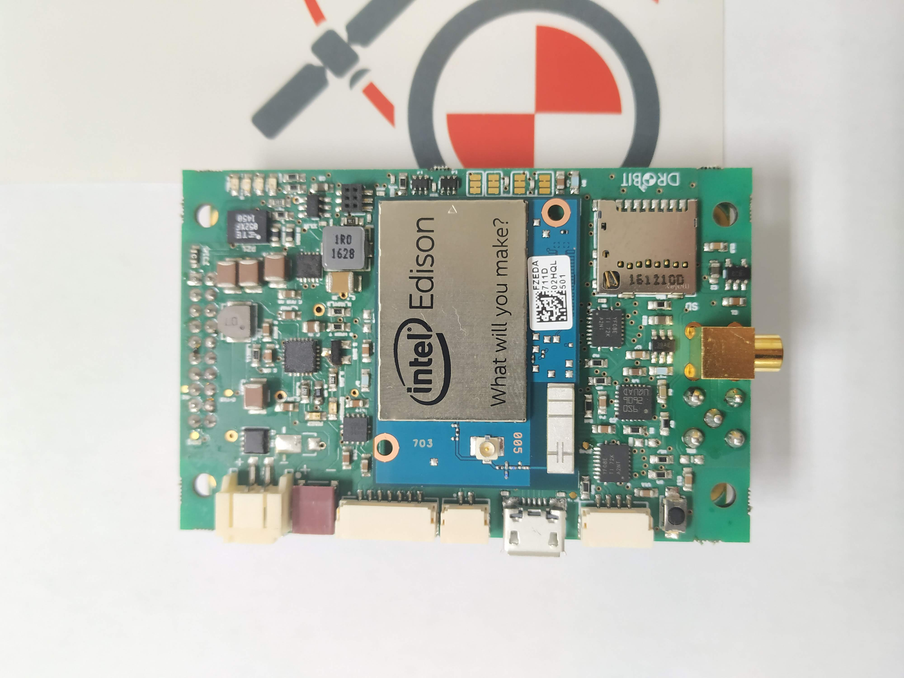
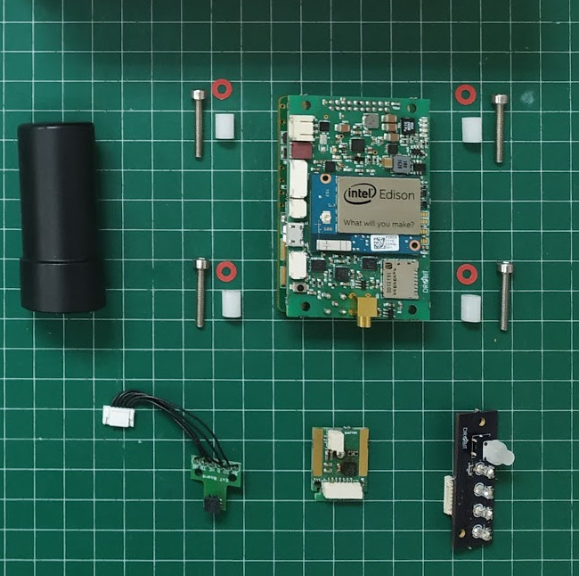

# Drobit-HW
 This repository contains the electronic design and BOM files of the Drobit HW ecosystem.

 Drobit is a PPK (Post Processing Kinematics) solution for the UAV industry. Drobit allows to precisely geotag pictures taken by a camera on board the UAV allowing GCP-free (ground control point) photogrammetry surveys.

  

 Drobit HW ecosystem is:
 * Drobit Main board
    * Intel Edison CPU
    * Dual-Freq GNSS Board from ComNav
    * 9Dof IMU
    * Batttery management 
 * Drobit Hotshoe board
    * Camera flash signal conditioning
    * 9Dof IMU 
 * Optional: External Button-LED board for cases
 * Optional: Micro connector breakboard

 
 
 ## History
 Drobit was created in 2016 by Jose Martinez Rubio and Jesús Alvarez in order to overcome one of the main limitations when doing UAV Photogrammetry applied to big survey areas.... the manual positioning of GCPs.

 Drobit has been used too as *Drobit Inspector* for Civil infrastructure inspection.

 As of today, Drobit has finished its commercial life and we decided to opensource both HW and SW.

 ## Theory of operation
 The idea behind drobit is to provide aerial imagery with super precise WGS84 coordinates of the lens nodal point. If that's the case, photogrammetry software like Agisoft Metashaper or Pix4D can reconstruct the terrain 3D model with centimeter accuracy (with no GCP).

 In order to do that Drobit incorporates a Dual Frequency Survey grade GPS (ComNav 501G) with a Heical Harxon Dual frecuency Antenna that provides 20Hz RAW GNSS observations. We will use Differential GPS as the main source of precise geopositioning.
 It also contains two 9dof IMU, one in the drobit main board and one in the drobit hotshoe board.

 The hotshoe board will be inserted into the camera hotshoe and will provide precise timing for every picture by sensing the flash trigger.

 In a photogrammetry UAV flight, drobit will record GNSS observations (for later postprocessing PPK) and will capture IMU orientation for both drobit main board and hotshoe board.

## Post Processing (PPK and coordinates translation)
 Later, in the office, Drobit PPK Software will obtain precise GPS (WGS84) coordinates from the antenna phase center by resolving the PPK against a GNSS Base receiver (Drobit base or any other manufacturer base with Rinex, even a CORS).

 In order to obtain the nodal camera point position, Drobit PPK Software needs to translate the GNSS antenna coordinate using IMU values and X,Y,Z offsets.

 Once finished, pictures are geotagged and a file containing picture name and precise coordinates is generated.

 Drobit PPK Software creates an kmz for google earth that allows to see cameras oriented and located in 3d space.

 

